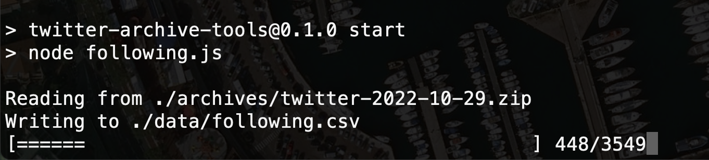

# twitter-archive-tools

*Tools for making Twitter archive data more useful and portable*

## Intro

Before you can use this you'll need to download your Twitter account data archive.

1. Go to twitter.com (use the website, not a mobile app).
2. Sidebar: More button → Your Account → Download an archive of your data → Request archive button (you'll probably be prompted to do an account verification along the way).
3. Wait for an email update. The subject line will look like "@[username] your Twitter data is ready."
4. Click on the link in the email and you'll get a zip file download.

It might take a day or two, depending on how much data your account has generated. Once you download the archive, feel free to unzip and click around to see what is in there. You can open `Your archive.html` in a web browser.

You may notice that there isn't really much "following" or "follower" user data in there. The code in this repo takes the numeric account IDs from `following.js` and uses them to scrape more detailed account information from the web, then save the results to a CSV file.

So far that's all I have working. The resulting `following.csv` export includes the following columns:

* `id`
* `username`
* `name`
* `image` (profile image URL)
* `description`
* `location`
* `url` (t.co redirect URL to profile link)
* `joined` (e.g., "Joined August 2007")

## Setup

1. Install dependencies: `npm install`
2. Put your Twitter account data zip file in the `archives` folder
3. Run `npm start`

## Input data

* `archives/twitter-*.zip`

## Output data

* `data/following.csv`
* `data/account/[account id].json` (used to cache account data)

## Why not use the Twitter API?

I considered writing this using the Twitter API, but since it doesn't access any privileged information scraping was a bit simpler to get setup.

## See also

* [twarc](https://pypi.org/project/twarc/) ([example](https://twitter.com/IgorBrigadir/status/1587170258959450116))
